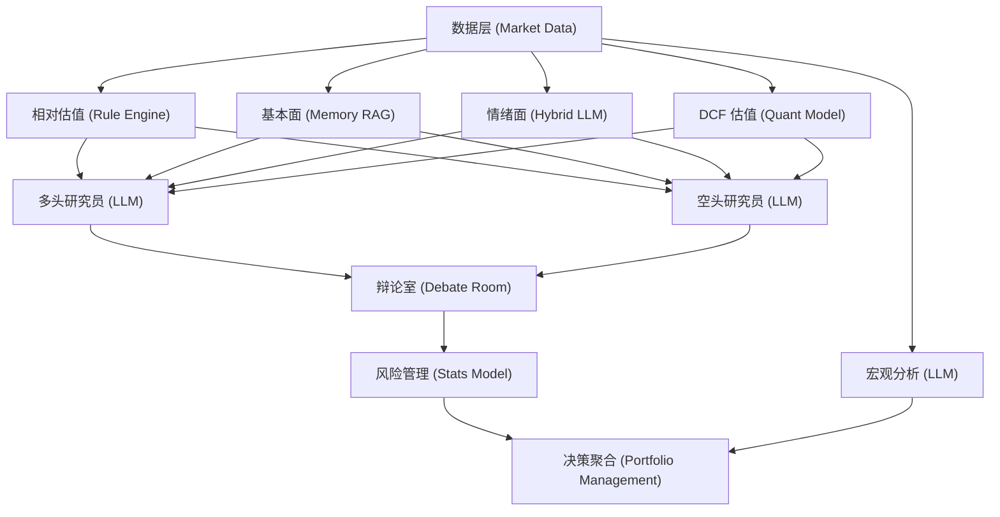

# A-Share Agent: 基于异构多智能体的 A 股价值投资分析系统

本系统是一款专为 A 股设计的智能投资分析平台，通过 **异构多智能体 (Heterogeneous Multi-Agents)** 协作，结合 **检索增强生成 (RAG)** 与 **本地优先 (Local-First)** 数据策略，为用户提供专业的价值投资决策支持。

## 核心亮点

- **异构协作架构**：集成规则引擎、量化模型、统计模型及多种 LLM 节点，实现真正的异构智能协作。
- **价值投资导向**：系统深度整合 DCF 现金流折现模型与基本面分析，拒绝纯技术面投机。
- **检索增强 (RAG)**：基于 SQLite 的元数据约束检索系统，为 Agent 提供长期记忆能力。
- **本地优先策略**：支持本地 CSV 数据适配，确保回测过程中的数据可落地、可重复、安全性高。
- **消融实验框架**：支持模块化消融配置，量化评估各 Agent 对系统决策的贡献度。

---

## 系统架构



---

## 快速启动

### 1. 环境准备
项目依赖 Python 3.10+。建议使用虚拟环境：
```bash
python -m venv venv
.\venv\Scripts\activate
pip install -r requirements.txt
```

### 2. 配置环境
复制 `.env.example` 为 `.env` 并填写 API Key：
```bash
# OpenAI 兼容 API 配置
OPENROUTER_API_KEY=your_key_here
```

### 3. 运行系统
- **启动全栈 (后端+前端)**：
  可以直接执行 `start_fullstack.cmd` 启动后端 FastAPI (8000) 和前端 Vite (5173)。
- **命令行分析任务**：
  ```bash
  python -m src.core.engine.main --ticker 600519 --show-reasoning
  ```

---

## 目录说明

- `src/`: 系统核心源码 (Agents, Core, Data, RAG, Tools)
- `backend/`: FastAPI 后端服务
- `frontend/`: React + Ant Design 前端界面
- `data/`: 本地 CSV/SQLite 数据存储
- `tests/`: 完整的单元测试与集成测试集
- `artifacts/`: 实验产出物与报表存档

---

## 开发者
*Antigravity 协作开发*
