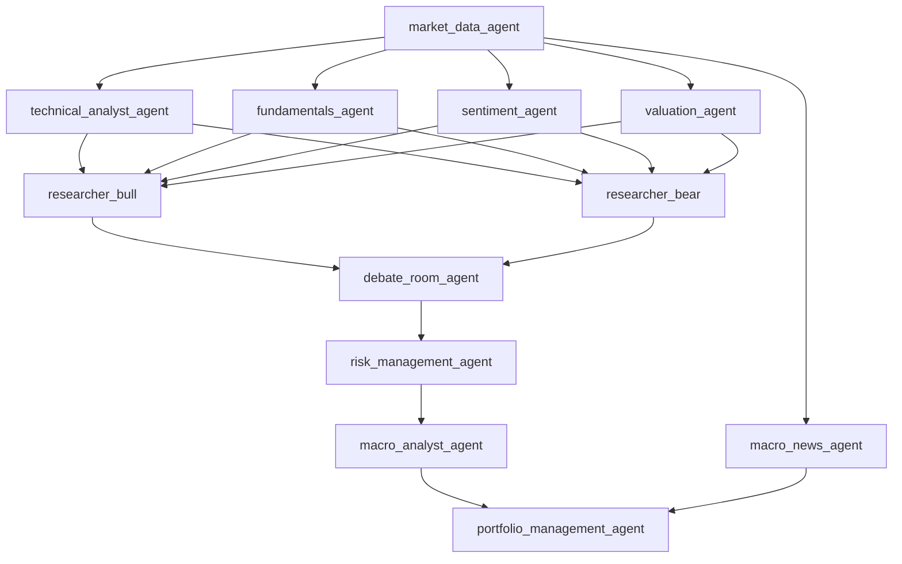

# 姣曚笟璁捐鎵ц鎸囧崡锛堥」鐩榻愪笌瀹¤鍙嬪ソ鐗?v4锛?
> 鏇存柊鏃ユ湡锛?026-04-08  
> 閫傜敤浠撳簱锛歚AShareAgent` 褰撳墠宸ヤ綔鍖? 
> 鏈枃鐢ㄩ€旓細浣滀负鍚庣画寮€鍙戙€佽鏂囨挵鍐欍€佽仈璋冮獙璇佸拰 Git 绠＄悊鐨勭粺涓€鎵ц鏍囧噯  
> 鏈増鏈浛浠ｆ棫鐗堚€?4 澶╁啿鍒烘竻鍗曞紡鎸囧崡鈥濓紝鏀逛负鈥滃伐绋嬭鑼?+ 闃舵璺嚎鍥?+ 瀹¤鍙嬪ソ鍙ｅ緞鈥?> v4 閲嶇偣淇锛氬厛鍋氬崗璁笌鍛藉悕鏀舵暃锛屽啀鍋?Agent 璇箟鏀舵暃锛屾渶鍚庡啀涓?RAG

---

## 1. 椤圭洰瀹氫綅

- 璇鹃鍚嶇О锛氬熀浜庡紓鏋勫鏅鸿兘浣撶殑 A 鑲′环鍊兼姇璧勫垎鏋愮郴缁?- 椤圭洰鎬ц川锛氳绠楁満涓撲笟姣曚笟璁捐锛岄噸鐐逛笉鍦ㄩ噾铻嶇瓥鐣ョ偒鎶€锛岃€屽湪绯荤粺鏋舵瀯銆佸崗璁璁°€佹绱㈠寮恒€佸疄楠屾柟娉曚笌宸ョ▼鍙鐜版€?- 鏍稿績璐＄尞搴旇仛鐒︿簬浠ヤ笅 3 鐐癸細
  1. 寮傛瀯澶氭櫤鑳戒綋鏋舵瀯锛氳鍒欍€侀噺鍖栥€佺粺璁°€丩LM 鍗忓悓宸ヤ綔锛岃€屼笉鏄€滃叏鍛樿皟鐢ㄥぇ妯″瀷鈥?  2. 妫€绱㈠寮鸿瘉鎹眰锛氫负涓昏鍒嗘瀽鍨?Agent 鎻愪緵鍙拷婧殑鍘嗗彶璇佹嵁涓庤蹇嗕笂涓嬫枃
  3. 澶氱淮搴︽秷铻嶈瘎浼帮細涓嶄粎姣旇緝鏀剁泭锛屼篃姣旇緝寤惰繜銆佹垚鏈€侀瞾妫掓€т笌鍙В閲婃€?
---

## 2. 鎴嚦 2026-04-08 鐨勭湡瀹為」鐩姸鎬?
### 2.1 宸插畬鎴?
- 宸叉帴鍏ユ湰鍦?CSV 閫傞厤灞傦細`src/tools/local_csv_provider.py`
- 宸插畬鎴?`api.py` 鐨勬湰鍦颁紭鍏堟敼閫狅紝鏀寔鍥炴祴绂佽繙绋嬶細`src/tools/api.py`
- 宸插畬鎴?3 涓潪 LLM Agent 鐨勫紓鏋勯噸鍐欙細
  - `src/agents/technicals.py` -> `rule_engine`
  - `src/agents/valuation.py` -> `quantitative_model`
  - `src/agents/risk_manager.py` -> `statistical_model`
- 宸插畬鎴?`market_data.py` 鐨?local-first 鍜?backtest-safe 鏀归€狅細`src/agents/market_data.py`
- `tests/unit` 褰撳墠楠岃瘉缁撴灉锛歚121 passed`

### 2.2 灏氭湭瀹屾垚

- `fundamentals.py` 浠嶆槸鏃х増瑙勫垯寮忓熀鏈潰鍒嗘瀽锛屽皻鏈崌绾т负鈥滄姢鍩庢渤 + 璇佹嵁妫€绱⑩€滱gent
- `sentiment.py` 浠嶆槸鏃х増鏂伴椈鎯呯华鍒嗘瀽锛屽皻鏈崌绾т负鈥滆储鎶ヨ川閲?绾㈡棗 + 鏂囨湰瑙ｉ噴鈥濇贩鍚?Agent
- `macro_analyst.py` 浠嶆槸鏃х増瀹忚/鏂伴椈鍒嗘瀽锛屽皻鏈崌绾т负鈥滆涓氬懆鏈?+ 鏀跨瓥鏁忔劅搴︹€滱gent
- 缁熶竴杈撳嚭鍗忚浠嶆湭姝ｅ紡钀藉湴锛屽悗绔拰鍓嶇杩樺湪鍏煎澶氱鏃ц繑鍥炲舰鎬?- Agent 鍛藉悕銆佸瓧娈靛懡鍚嶃€佽涔夎竟鐣屽皻鏈畬鍏ㄦ敹鏁涳紝瀛樺湪鈥滃悕瀛楀拰鐪熷疄鑱岃矗涓嶄竴鑷粹€濈殑闂
- 鍓嶇瀵瑰紓鏋?Agent 鐨勫睍绀鸿繕鏈畬鍏ㄦ寜鏂扮粨鏋勫榻?- 娑堣瀺瀹為獙妗嗘灦鏈疄鐜?
### 2.3 褰撳墠鐪熷疄宸ヤ綔娴?


璇存槑锛?
- `market_data_agent` 鏄笂娓告暟鎹叆鍙?- `technicals / fundamentals / sentiment / valuation` 鏄涓€灞傚垎鏋愯妭鐐?- `researcher_bull / researcher_bear / debate_room` 璐熻矗瑙傜偣瀵规姉涓庢眹鎬?- `risk_management_agent` 涓?`macro_analyst_agent` 鍦ㄥ喅绛栧悗娈电户缁ˉ鍏呯害鏉熶笌鐜鍒ゆ柇
- `portfolio_management_agent` 鏄渶缁堣仛鍚堣妭鐐?
---

## 3. 浠撳簱鐪熺浉涓庤竟鐣屾潯浠?
浠ヤ笅鍐呭蹇呴』浠ュ綋鍓嶄粨搴撶湡瀹炵粨鏋勪负鍑嗭紝鑰屼笉鏄互鏃х増璁″垝涓殑鐞嗘兂缁撴瀯涓哄噯銆?
### 3.1 瀹為檯瀛樺湪鐨勬牳蹇?Agent 鏂囦欢

- `src/agents/market_data.py`
- `src/agents/technicals.py`
- `src/agents/fundamentals.py`
- `src/agents/sentiment.py`
- `src/agents/valuation.py`
- `src/agents/researcher_bull.py`
- `src/agents/researcher_bear.py`
- `src/agents/debate_room.py`
- `src/agents/risk_manager.py`
- `src/agents/macro_analyst.py`
- `src/agents/macro_news_agent.py`
- `src/agents/portfolio_manager.py`

### 3.2 褰撳墠鏁版嵁灞傜湡鐩?
- 鏈湴绂荤嚎鏁版嵁缁熶竴鏀惧湪浠撳簱鏍圭洰褰?`data/`
- 浠锋牸銆丳B銆佷笂甯備俊鎭€佷氦鏄撴棩鍘嗗凡缁忔湁鏈湴 CSV 鍏ュ彛
- 鏂伴椈銆佸畯瑙傘€侀儴鍒嗚储鍔℃暟鎹粛鍙兘渚濊禆杩滅▼鎺ュ彛鎴栨湰鍦?SQLite 缂撳瓨
- 椤圭洰宸叉湁 SQLite 鏁版嵁搴撹兘鍔涳紝榛樿鏁版嵁搴撴枃浠朵綅浜?`data/ashare_agent.db`

### 3.3 褰撳墠渚濊禆鐪熺浉

- 宸叉湁锛歚langgraph`銆乣langchain`銆乣akshare`銆乣yfinance`銆乣openai` 绛?- 灏氭棤锛歚chromadb`銆乣sentence-transformers`銆乣faiss`
- 鍥犳鍚庣画 RAG 璁捐涓嶅緱鍋囪鈥滃悜閲忓簱宸茬粡瀛樺湪鈥?
---

## 4. 涓嶅彲鐮村潖鐨勭‖绾︽潫

鍚庣画鎵€鏈夋敼閫犻兘蹇呴』閬靛畧浠ヤ笅绾︽潫銆?
### 4.1 LangGraph 澶栧眰杩斿洖缁撴瀯涓嶅彉

姣忎釜鑺傜偣浠嶇劧蹇呴』杩斿洖锛?
```python
{
    "messages": ...,
    "data": ...,
    "metadata": ...,
}
```

涓嶅緱灏?LangGraph 鑺傜偣鐩存帴鏀逛负鍙繑鍥炲崟涓€ Pydantic 瀵硅薄銆?
### 4.2 local-first 鏄熀纭€鍘熷垯

- 浠锋牸閾捐矾榛樿浼樺厛璧版湰鍦?CSV
- 鍥炴祴妯″紡涓嬬姝㈣繙绋嬩环鏍兼帴鍙?- 鍥炴祴妯″紡涓嬫柊澧炵殑 RAG 涔熷繀椤绘敮鎸佹湰鍦拌繍琛屼笌鍙噸澶嶆墽琛?
### 4.3 RAG 涓嶈兘鎴愪负鍗曠偣鏁呴殰

- 鐭ヨ瘑搴撲笉鍙敤鏃讹紝Agent 浠嶉渶缁欏嚭鍚堟硶杈撳嚭
- 妫€绱㈠け璐ユ椂瑕佽蛋闄嶇骇璺緞锛屼笉鍏佽鎷栧灝涓绘祦绋?- 涓嶅厑璁稿洜涓哄悜閲忔绱㈠紓甯稿鑷存暣涓伐浣滄祦涓柇
- 涓嶅厑璁稿洜涓鸿涔夌浉浼艰€岃法鑲＄エ浠ｇ爜璇彫鍥炲巻鍙插垎鏋?
### 4.4 `agent_outputs` 鏄爣鍑嗗寲杈撳嚭灞傦紝涓嶆浛浠ｄ富娴佺▼閫氫俊

- 鍐崇瓥涓婚摼褰撳墠涓昏娑堣垂 `messages` 涓?`data`
- `agent_outputs` 鐨勪綔鐢ㄦ槸锛?  - 涓哄墠绔彁渚涚粺涓€灞曠ず缁撴瀯
  - 涓烘祴璇曟彁渚涚ǔ瀹氭柇瑷€鍏ュ彛
  - 涓哄悗缁崗璁粺涓€鍋氶摵鍨?- 鍥犳鏂?Agent 蹇呴』鍚屾椂缁存姢锛?  - 鐜版湁娑堟伅閫氶亾
  - 鐜版湁 `data` 瀛楁
  - 鏍囧噯鍖?`agent_outputs`

### 4.5 娑堟伅鍛藉悕蹇呴』绋冲畾

鍚庣画宸ヤ綔涓繀椤荤粺涓€浠ヤ笅娑堟伅鍛藉悕绾﹀畾锛?
- `technical_analyst_agent`
- `fundamentals_agent`
- `sentiment_agent`
- `valuation_agent`
- `researcher_bull`
- `researcher_bear`
- `debate_room_agent`
- `risk_management_agent`
- `macro_analyst_agent`
- `portfolio_management_agent`

璇存槑锛?
- 鍘嗗彶涓婂瓨鍦?`researcher_bull_agent` / `researcher_bull` 绛夊吋瀹瑰埆鍚?- 鍚庣画鏂板閫昏緫搴斾互鈥滃崟涓€瑙勮寖鍛藉悕鈥濅负鐩爣锛屽吋瀹归€昏緫浠呬繚鐣欏湪杩囨浮闃舵

### 4.6 Git 浠撳簱鍗敓蹇呴』鍙楁帶

浠ヤ笅鍐呭榛樿涓嶈繘鍏?GitHub锛?
- `data/`
- `.superpowers/`
- `stitch/`
- 鏈湴鏁版嵁搴撴枃浠?- 鏈湴缂撳瓨銆佹棩蹇椼€佹埅鍥俱€侀瑙堟枃浠?- 浼氳璁板綍绫绘枃浠讹紝闄ら潪鏄庣‘闇€瑕佺撼鍏ョ増鏈鐞?
### 4.7 褰撳墠闃舵浼樺厛瑙ｅ喅鈥滃崗璁紓绉烩€?
鍦ㄧ户缁鍔犳柊鑳藉姏鍓嶏紝蹇呴』浼樺厛鏀舵暃浠ヤ笅闂锛?
- 鍚庣渚濊禆 agent 鍚嶇О鏄犲皠銆乵etadata 鐗瑰垽鍜屽閲?fallback 鎷肩粨鏋?- 鍓嶇渚濊禆澶氱杩斿洖褰㈡€佸拰鎵嬪姩鍚嶇О鏄犲皠閫傞厤灞曠ず
- `agent_outputs` 宸叉湁鍩虹锛屼絾灏氭湭鎴愪负鐪熸绋冲畾鐨勭粺涓€鍑哄彛

鍥犳锛屽綋鍓嶉樁娈电殑鏈€楂樹紭鍏堢骇涓嶆槸鈥滃厛鍔犳洿澶氬垎鏋愯兘鍔涒€濓紝鑰屾槸锛?
1. 鏀舵暃娑堟伅鍛藉悕
2. 鏀舵暃 `agent_outputs`
3. 璁╁悗绔拰鍓嶇閫愭浠ョǔ瀹氬崗璁负涓伙紝鑰屼笉鏄户缁爢鍏煎灞?
### 4.8 闈炴牳蹇冭寖鍥村喕缁?
鏈」鐩綋鍓嶉樁娈甸粯璁ゅ喕缁撲互涓嬭寖鍥达紝涓嶅啀缁х画鎵╁睍鍔熻兘锛?
- 璁よ瘉銆佹潈闄愩€佺敤鎴蜂綋绯?- 鐢熶骇绾х洃鎺с€佸憡璀︺€佸璁″钩鍙板寲鑳藉姏
- Redis銆丆DN銆乄AF銆侀泦缇ゃ€侀珮鍙敤閮ㄧ讲绛変紒涓氱骇鍖呰
- 涓庢瘯璁句富绾挎棤鐩存帴鍏崇郴鐨勫悗鍙板鍥磋兘鍔?
璇存槑锛?
- 杩欎簺鍐呭鍙互淇濈暀鍦ㄧ幇鏈変粨搴撲腑锛屼絾涓嶄綔涓哄悗缁紑鍙戦噸鐐?- 璁烘枃涓庣瓟杈╁彊浜嬪簲鍥寸粫寮傛瀯 Agent銆佸崗璁敹鏁涖€佽蹇嗗瀷 RAG銆佽仈璋冮獙璇佸拰娑堣瀺瀹為獙灞曞紑

---

## 5. 浼樺寲鍚庣殑鎬讳綋鎶€鏈矾绾?
### 5.1 鎬诲師鍒?
鏈」鐩笉鏄€滄墍鏈?Agent 閮界敤 LLM鈥濈殑绯荤粺锛屼篃涓嶆槸鈥滄妸鎵€鏈夋暟鎹悜閲忓寲鈥濈殑绯荤粺銆?
浼樺寲鍚庣殑鎶€鏈矾绾垮簲涓猴細

1. 鍏堟敹鏁涘崗璁拰鍛藉悕锛岄檷浣庣郴缁熻В閲婃垚鏈?2. 鍐嶆敹鏁涚涓€灞?Agent 鐨勮涔夎竟鐣?3. 缁撴瀯鍖栧洜瀛愮户缁蛋纭畾鎬ц绠?4. 涓昏鍒嗘瀽绫讳换鍔″紩鍏ユ绱㈠寮?5. 鍓嶇涓庡疄楠屾鏋跺洿缁曞紓鏋勭壒寰佸睍寮€

### 5.2 寮傛瀯鏋舵瀯鍒嗗眰

| 灞傜骇 | 浣滅敤 | 鍏稿瀷鑺傜偣 | 涓昏鏂规硶 |
|:--|:--|:--|:--|
| 鏁版嵁灞?| 鎻愪緵鏈湴浼樺厛杈撳叆 | `market_data_agent` | CSV / SQLite / API |
| 纭畾鎬у垎鏋愬眰 | 杈撳嚭鍙噸澶嶃€佷綆寤惰繜淇″彿 | `technicals` / `valuation` / `risk_manager` | 瑙勫垯 / 鏁板妯″瀷 / 缁熻 |
| 璇佹嵁澧炲己鍒嗘瀽灞?| 澶勭悊涓昏鏂囨湰鍒ゆ柇 | `fundamentals` / `sentiment` / `macro_analyst` | LLM + 妫€绱?+ 瑙勫垯 |
| 瑙傜偣鍗氬紙灞?| 澶氱┖瑙傜偣鏁村悎 | `researcher_bull` / `researcher_bear` / `debate_room` | Prompt + 鑱氬悎 |
| 鍐崇瓥灞?| 鏈€缁堜氦鏄撳缓璁?| `portfolio_manager` | 鑱氬悎鍐崇瓥 |

### 5.3 褰撳墠闃舵鏈€浼樻墽琛岄『搴?
鎸夊綋鍓嶄粨搴撶姸鎬侊紝鏈€浼樻墽琛岄『搴忎笉鏄€滃厛涓?RAG鈥濓紝鑰屾槸锛?
1. 鍏堢粺涓€娑堟伅鍛藉悕鍜?`agent_outputs`
2. 鍐嶆槑纭涓€灞?4 涓?Agent 鐨勮涔夎竟鐣?3. 淇 `technicals` 鐨勫懡鍚嶆垨鑱岃矗锛屼娇鍏朵笉鍐嶄吉瑁呮垚浼犵粺鎶€鏈垎鏋?4. 鑻ヨ鎶?`sentiment` 鏀规垚璐㈡姤璐ㄩ噺 Agent锛屽繀椤诲悓姝?researcher銆乸ortfolio 鍜屽墠绔涔?5. 鍙粰 `fundamentals` 鍏堜笂 SQLite-first 鐨勮蹇嗗瀷 RAG
6. `macro_analyst` 鍏堝仛绋冲畾缁撴瀯鍖栬緭鍑哄拰鍏滃簳锛屼笉鎬ョ潃鍋氶噸妫€绱?7. 5 鍙偂绁ㄨ仈璋冭窇閫氬悗锛屽啀鍋氬墠绔敹鏁涘拰娑堣瀺瀹為獙

---

## 6. 鏈€閫傚悎鏈」鐩殑 RAG 鏋舵瀯

### 6.1 鎺ㄨ崘缁撹

鏈」鐩帹鑽愰噰鐢細

**鍏冩暟鎹害鏉熺殑璁板繂鍨?RAG锛圡etadata-Constrained Memory RAG锛?*

鏇村噯纭湴璇达紝杩欐槸涓€绉嶉潰鍚戦噾铻嶅疄浣撻殧绂诲満鏅殑妫€绱㈠寮烘柟妗堛€傚畠鐨勬牳蹇冪洰鏍囦笉鏄€滃敖鍙兘澶氬湴鍙洖鐩镐技鏂囨湰鈥濓紝鑰屾槸锛?
1. 鍏堢‘淇濅笉浼氫覆绁?2. 鍐嶅湪瀹夊叏杈圭晫鍐呭仛璇箟鍖归厤
3. 鏈€鍚庢妸灏戦噺楂樹环鍊煎巻鍙茶蹇嗘敞鍏ュ綋鍓嶅垎鏋?
### 6.2 涓轰粈涔堝畠姣旈€氱敤鍙屽彫鍥炴洿閫傚悎鏈」鐩?
鏈」鐩潰涓寸殑棣栬椋庨櫓涓嶆槸鈥滄紡鍙洖鈥濓紝鑰屾槸鈥滆法鏍囩殑璇彫鍥炩€濄€?
鍏稿瀷椋庨櫓鍖呮嫭锛?
- 鍒嗘瀽 `600519` 鏃惰鍙洖 `000858` 鐨勫巻鍙茬粨璁?- 鐧介厭銆侀摱琛屻€佺數鍔涚瓑鍚岃川鍖栨澘鍧椾腑锛屽洜涓烘枃鏈〃杩扮浉浼艰€屽嚭鐜板疄浣撲氦鍙夋薄鏌?- 鍚屼竴鍙偂绁ㄥ湪涓嶅悓瀛ｅ害琚敊璇户鎵夸笉閫傜敤鐨勬棫缁撹

鍥犳锛屾湰椤圭洰鐨?RAG 蹇呴』浼樺厛瑙ｅ喅锛?
- `stock_code` 闅旂
- `quarter / as_of_date` 闅旂
- `agent_type` 闅旂

杩欐剰鍛崇潃锛?
- 瀵逛綘鏉ヨ锛屸€滅‖杩囨护鈥濇瘮鈥滄洿澶嶆潅鐨勫彫鍥炵瓥鐣モ€濇洿閲嶈
- RAG 鏄?Agent 鐨勯暱鏈熻蹇嗙郴缁燂紝涓嶆槸閫氱敤鎼滅储寮曟搸

### 6.3 鏈」鐩腑鐨勨€滃弻閫氶亾鈥濆簲濡備綍瀹氫箟

濡傛灉璁烘枃涓渶瑕佷繚鐣欌€滃弻閫氶亾鈥濊〃杩帮紝搴斾娇鐢ㄤ互涓嬪畾涔夛紝鑰屼笉鏄収鎼€氱敤鏂囨。闂瓟绯荤粺鐨勮娉曘€?
鏈」鐩殑鈥滃弻閫氶亾鈥濇槸锛?
1. 缁撴瀯鍖栫‖閫氶亾锛氬熀浜庡厓鏁版嵁杩涜缁濆杩囨护
2. 闈炵粨鏋勫寲杞€氶亾锛氬湪纭繃婊ゅ悗鐨勫畨鍏ㄥ€欓€夐泦鍐呭仛璇箟妫€绱?
涔熷氨鏄锛屾湰椤圭洰涓嶆槸锛?
- `BM25 + 鍚戦噺` 鐨勫紑鏀惧煙鍙屽彫鍥?- `鏂囨湰 + 瑙嗚` 鐨勫妯℃€佸弻閫氶亾

鑰屾槸锛?
- `Metadata Hard Filter + Semantic Retrieval`

### 6.4 鎺ㄨ崘妫€绱㈡祦绋?
鎺ㄨ崘鐨勬绱㈡祦绋嬪浐瀹氫负锛?
1. 鎸?`stock_code` 鍋氱‖杩囨护
2. 鍐嶆寜 `quarter / as_of_date / agent_type / industry` 鍋氫簩绾ц繃婊?3. 浠呭湪杩囨护鍚庣殑鍊欓€夐泦涓婂仛璇箟鐩镐技搴︽帓搴?4. 杩斿洖 `top_k=3~5` 鏉″巻鍙茶蹇?5. 浠呭皢鎽樿銆佸紩鐢ㄥ拰鏉ユ簮娉ㄥ叆 Prompt
6. 褰撳墠鍒嗘瀽瀹屾垚鍚庯紝灏嗙粨鏋滃洖鍐欏埌鐭ヨ瘑搴?
鎺ㄨ崘鍘熷垯锛?
- 鈥滃厛闅旂锛屽啀鐩镐技鈥?- 涓嶅厑璁糕€滃厛鍏ㄥ簱鐩镐技锛屽啀浜哄伐瑙ｉ噴鈥?
### 6.5 涓轰粈涔堜笉閲囩敤鈥滃叏閲忓悜閲忓寲鈥?
浠ヤ笅鏁版嵁涓嶉€傚悎鏀惧叆鍚戦噺搴撲綔涓轰富瀛樺偍锛?
- OHLCV 鏃跺簭
- PB 鍘嗗彶搴忓垪
- 鎶€鏈寚鏍?- DCF 璁＄畻涓棿閲?- VaR銆佹尝鍔ㄧ巼銆佸洖鎾ょ瓑绾暟鍊煎洜瀛?
鍘熷洜锛?
- 杩欑被淇℃伅鏇撮€傚悎绮剧‘璁＄畻锛屼笉閫傚悎璇箟妫€绱?- 鍚戦噺鍖栦細寮曞叆涓嶅繀瑕佺殑涓嶇‘瀹氭€?- 浼氬墛寮卞洖娴嬪彲閲嶅鎬у拰鍙В閲婃€?
鍥犳锛屾湰椤圭洰鐨?RAG 鏇存帴杩戔€滆蹇嗗寮哄眰鈥濓紝鑰屼笉鏄€滅粺涓€鐭ヨ瘑瀛樺偍灞傗€濄€?
### 6.6 鏈€閫傚悎褰撳墠浠撳簱鐨勫瓨鍌ㄦ柟妗?
鎺ㄨ崘閲囩敤鈥滀袱绾у疄鐜扮瓥鐣モ€濄€?
#### 绗竴闃舵锛歋QLite-first 璁板繂鍩虹嚎鏂规

- 缁х画浣跨敤鐜版湁 `data/ashare_agent.db`
- 鍦ㄦ暟鎹簱鍐呮柊澧炵煡璇嗗簱鐩稿叧琛?- 鎶婄煡璇嗗簱瀛樺偍涓衡€滃甫鍏冩暟鎹殑鍒嗘瀽璁板繂鈥濓紝鑰屼笉鏄硾鏂囨。浠撳簱

鎺ㄨ崘琛ㄧ粨鏋勬柟鍚戯細

- `kb_documents`
- `kb_chunks`
- `kb_analysis_history`

鏈€浣庡厓鏁版嵁瀛楁搴斿寘鍚細

- `stock_code`
- `industry`
- `agent_type`
- `analysis_date`
- `quarter`
- `source_type`

鎺ㄨ崘妫€绱㈠疄鐜帮細

1. 鍏堝仛鍏冩暟鎹繃婊?2. 鍐嶅仛鍊欓€夐泦鍐呮枃鏈尮閰嶆垨杞婚噺鐩镐技搴︽帓搴?3. 杩斿洖灏戦噺楂樼浉鍏冲巻鍙茶蹇?
浼樼偣锛?
- 涓庡綋鍓嶉」鐩凡鏈?SQLite 鑳藉姏澶╃劧鍏煎
- 鍥炴祴妯″紡鏇寸ǔ瀹?- 涓嶆柊澧為噸渚濊禆
- 鏇撮€傚悎鍏堟妸 Day4 璺戦€?
#### 绗簩闃舵锛氬彲鎻掓嫈鍚戦噺澧炲己鏂规

褰撳熀绾挎柟妗堣窇閫氬悗锛屽啀鍙€夊鍔狅細

- `sentence-transformers` 浣滀负 embedding 缁勪欢
- `ChromaDB` 鎴栧叾浠栧悜閲忓悗绔綔涓哄€欓€夐泦鍐呭寮烘帓搴忓眰

娉ㄦ剰锛?
- 鍚戦噺灞傛槸澧炲己锛屼笉鏄敮涓€渚濊禆
- 涓嶅簲鎶?`fundamentals.py` 鐩存帴缁戞鍒版煇涓€鍚戦噺搴撳疄鐜?- 鍗充娇浣跨敤 `ChromaDB`锛屼篃蹇呴』淇濈暀鍏冩暟鎹‖杩囨护浼樺厛绾?
### 6.7 鍝簺鍐呭杩涘叆鐭ヨ瘑搴?
搴旇杩涘叆鐭ヨ瘑搴擄細

- 鍘嗗彶 `fundamentals` 杈撳嚭鐨勬姢鍩庢渤鍒嗘瀽鎽樿
- 鍏徃鐩稿叧鏂伴椈姝ｆ枃涓庡厓鏁版嵁
- 瀹忚鏀跨瓥銆佽涓氬叕鍛娿€佽涓氬懆鏈熸潗鏂?- 浜哄伐鏁寸悊鍚庣殑鈥滃叕鍙哥珵浜変紭鍔夸簨瀹炴憳瑕佲€?- 璐㈡姤涓殑鏂囨湰鎬ч闄╃偣涓庢憳瑕佹€ц瘉鎹?
涓嶅簲璇ョ洿鎺ヨ繘鍏ョ煡璇嗗簱浣滀负涓绘绱㈠璞★細

- 鍘熷 OHLCV
- 鍘熷 PB 鏃跺簭
- 楂橀鎶€鏈寚鏍?- 绾暟鍊艰储鎶ュ瓧娈靛叏闆?- 瀹屾暣 chain-of-thought
- 楂橀鍣０缂撳瓨

### 6.8 RAG 杈撳嚭娉ㄥ叆鍘熷垯

RAG 涓嶅簲鎶婃暣娈靛師鏂囧杩?`state["messages"]`銆?
鎺ㄨ崘鍙紶閫掞細

- 妫€绱㈡憳瑕?- 寮曠敤鐗囨鍒楄〃
- 鏂囨。 ID / citation ID
- 浣跨敤鍒扮殑璇佹嵁鏉ユ簮璇存槑
- 褰撳墠妫€绱㈡潯浠舵憳瑕侊紝渚嬪 `stock_code` 涓庢椂闂磋寖鍥?
杩欐牱鍙互閬垮厤锛?
- 鐘舵€佽啫鑳€
- 閲嶅浼犻€掑ぇ娈垫枃鏈?- 涓嬫父鑱氬悎鑺傜偣琚棤鍏充笂涓嬫枃姹℃煋

### 6.9 RAG 闄嶇骇绛栫暐

鐭ヨ瘑搴撴ā鍧楀繀椤绘敮鎸佷互涓嬮檷绾э細

1. 鏁版嵁搴撲笉鍙敤锛氳繑鍥炵┖妫€绱㈢粨鏋滐紝涓嶆姏鑷村懡寮傚父
2. 鍏冩暟鎹繃婊ゆ棤缁撴灉锛氱户缁寜鏃犲巻鍙茶蹇嗘ā寮忚繍琛?3. 鏂囨湰鍖归厤鎴栧悜閲忔帓搴忎笉鍙敤锛氬洖閫€鍒版洿绠€鍗曠殑鍊欓€夐泦鍖归厤
4. 妫€绱负绌猴細Agent 缁х画鎸夋棤妫€绱笂涓嬫枃杩愯

### 6.10 璁烘枃琛ㄨ堪寤鸿

宸ョ▼瀹炵幇涓紝缁熶竴浣跨敤锛?
- `鍏冩暟鎹害鏉熺殑璁板繂鍨?RAG`

璁烘枃涓紝濡傞渶鏇存湁鏂规硶璁洪鏍肩殑鍚嶇О锛屽彲琛ㄨ堪涓猴細

- `寮傛瀯鍙岄€氶亾妫€绱㈢瓥鐣

浣嗘鏂囧繀椤绘槑纭鏄庯細

- 閫氶亾涓€鏄粨鏋勫寲鍏冩暟鎹‖杩囨护
- 閫氶亾浜屾槸杩囨护鑼冨洿鍐呯殑璇箟妫€绱?- 瀹冧笉鏄紑鏀惧煙 BM25+鍚戦噺鍙屽彫鍥烇紝涔熶笉鏄枃鏈?瑙嗚鍙岄€氶亾

瀹¤鍙嬪ソ鎻愰啋锛?
- 涓嶈鍦ㄦ湭瀹屾垚瀹為獙鍓嶅啓鈥滈敊璇巼涓?0鈥?- 涓嶈鍦ㄦ湭瀹為檯钀藉湴 SQL 杩囨护鏃跺啓鈥淪QL 绾у埆纭殧绂烩€?- 鎺ㄨ崘鍐欌€滃厓鏁版嵁纭繃婊も€濇垨鈥滃疄浣撶骇纭害鏉熲€?
---

## 7. Agent 鏀归€犵洰鏍囩煩闃?
### 7.1 宸插畬鎴愮殑寮傛瀯 Agent

| 鏂囦欢 | 鐩爣瑙掕壊 | 绫诲瀷 | 鐘舵€?|
|:--|:--|:--|:--|
| `src/agents/technicals.py` | 鐩稿浼板€间綅缃?Agent锛圥B 鐧惧垎浣嶏級 | `rule_engine` | 宸插畬鎴?|
| `src/agents/valuation.py` | DCF 浼板€?Agent | `quantitative_model` | 宸插畬鎴?|
| `src/agents/risk_manager.py` | 椋庨櫓璇勪及 Agent | `statistical_model` | 宸插畬鎴?|

### 7.2 涓嬩竴闃舵蹇呴』瀹屾垚鐨?Agent

| 鏂囦欢 | 鐩爣瑙掕壊 | 鎺ㄨ崘瀹炵幇 | 鐘舵€?|
|:--|:--|:--|:--|
| `src/agents/fundamentals.py` | 鎶ゅ煄娌?绔炰簤浼樺娍 Agent | `llm_rag` | 寰呭畬鎴?|
| `src/agents/sentiment.py` | 甯傚満鎯呯华 Agent 鎴栬储鎶ヨ川閲?Agent锛堜簩閫変竴鍚庡啀钀藉湴锛?| `hybrid_rule_llm` | 寰呭畬鎴?|
| `src/agents/macro_analyst.py` | 琛屼笟鍛ㄦ湡涓庢斂绛栨晱鎰熷害 Agent | `llm` | 寰呭畬鎴?|

---

## 8. 涓変釜寰呮敼閫?Agent 鐨勬槑纭姹?
### 8.0 绗竴灞?Agent 鐨勮涔夎竟鐣屽繀椤诲厛鏀舵暃

褰撳墠绗竴灞傚瓨鍦ㄤ袱涓槑鏄鹃棶棰橈細

- `technicals.py` 鐨勫疄鐜版槸 PB 鍘嗗彶鐧惧垎浣嶇浉瀵逛及鍊硷紝涓嶆槸浼犵粺鎶€鏈潰鍒嗘瀽
- `sentiment.py` 褰撳墠浠ｈ〃甯傚満鏂伴椈鎯呯华锛屼絾瑙勫垝涓兂鏀归€犳垚璐㈡姤璐ㄩ噺 Agent

鍥犳锛屽湪缁х画瀹炵幇鍓嶅繀椤诲厛鏀舵暃璇箟杈圭晫锛?
1. `technicals` 浜岄€変竴锛?   - 鏂规 A锛氭寮忔敼鍚嶄负鈥渞elative valuation鈥濇垨鈥滀及鍊间綅缃€?   - 鏂规 B锛氭仮澶嶄负鐪熷疄鎶€鏈寚鏍?Agent
2. `sentiment` 浜岄€変竴锛?   - 鏂规 A锛氱户缁壙鎷呪€滃競鍦烘儏缁€濊亴璐?   - 鏂规 B锛氬崌绾т负鈥滆储鎶ヨ川閲?绾㈡棗鈥濊亴璐?
濡傛灉閫夋嫨鏂规 B锛屽垯蹇呴』鍚屾淇敼锛?
- `researcher_bull.py`
- `researcher_bear.py`
- `portfolio_manager.py`
- 鍓嶇灞曠ず鏂囨

涓嶅厑璁稿彧鏀?`sentiment.py`锛屽嵈淇濈暀涓嬫父鎶婂畠褰撯€滃競鍦烘儏缁€濈殑鏃ц涔夈€?
### 8.1 `fundamentals.py`锛氭姢鍩庢渤涓庣珵浜変紭鍔?Agent

鐩爣锛?
- 涓嶅啀鍙仛浼犵粺璐㈠姟鎸囨爣鎵撳垎
- 鍗囩骇涓衡€滅粨鏋勫寲璐㈠姟浜嬪疄 + 鍚屾爣鐨勫巻鍙茶蹇嗘绱?+ LLM 鍒嗘瀽鈥濈殑缁煎悎 Agent

寤鸿鍒嗘瀽缁村害锛?
- 鍝佺墝澹佸瀿
- 鎴愭湰浼樺娍
- 杞崲鎴愭湰
- 缃戠粶鏁堝簲
- 娓犻亾鎴栬妯″鍨?- 鏀跨瓥鎴栫墝鐓у鍨?
鏈€浣庤緭鍑鸿姹傦細

- `agent_type`
- `signal`
- `confidence`
- `moat_rating`
- `score`
- `reasoning`
- `retrieved_refs`
- `memory_scope`

蹇呴』婊¤冻锛?
- 鍏煎鐜版湁 `fundamentals_agent` 鍑芥暟绛惧悕
- 鍏煎鐜版湁 LangGraph 澶栧眰 state 杩斿洖缁撴瀯
- 鏍囧噯鍖栫粨鏋滃啓鍏?`state["data"]["agent_outputs"]["fundamentals"]`
- 妫€绱㈠け璐ユ椂浠嶈繑鍥炲悎娉?JSON
- 妫€绱㈡椂蹇呴』鍏堟寜 `stock_code` 鍋氱‖杩囨护
- 濡傛湁鏃堕棿缁村害锛屽啀鎸?`quarter / as_of_date` 鍋氫簩绾ц繃婊?
### 8.2 `sentiment.py`锛氳储鎶ヨ川閲忎笌鏂囨湰绾㈡棗 Agent

鐩爣锛?
- 浠庘€滅畝鍗曟柊闂绘儏缁€濊浆鍚戔€滆鍒欑孩鏃?+ 鏂囨湰瑙ｉ噴鈥濈殑娣峰悎璺緞

绗竴灞傝鍒欏缓璁細

- 搴旀敹璐︽澧為€熸樉钁楅珮浜庤惀鏀跺閫?- 缁忚惀鐜伴噾娴佹樉钁楀急浜庡噣鍒╂鼎
- 鍟嗚獕鍗犲噣璧勪骇姣斾緥杩囬珮
- 瀛樿揣鍛ㄨ浆鐜囨寔缁笅婊?
绗簩灞?LLM 鑱岃矗锛?
- 瑙ｉ噴杩欎簺绾㈡棗鎰忓懗鐫€浠€涔?- 缁欏嚭椋庨櫓绛夌骇涓庣粨璁烘憳瑕?
蹇呴』婊¤冻锛?
- 鍗充娇 LLM 澶辫触锛岃鍒欏眰缁撴灉涔熷繀椤诲彲鐢?- 杈撳嚭鑷冲皯鍖呭惈锛氱孩鏃楁暟閲忋€佺孩鏃楁竻鍗曘€侀闄╃粨璁?- 鏍囧噯鍖栫粨鏋滃啓鍏?`state["data"]["agent_outputs"]["sentiment"]`
- 涓嬫父 Prompt銆佸瓧娈佃涔夊拰鍓嶇鏂囨蹇呴』鍚屾璋冩暣

濡傛灉褰撳墠闃舵涓嶅噯澶囧悓姝ユ敼涓嬫父锛屽垯搴旀殏缂撴鏀归€狅紝鍏堜繚鐣?`sentiment` 鐨勫競鍦烘儏缁亴璐ｃ€?
### 8.3 `macro_analyst.py`锛氳涓氬懆鏈熶笌鏀跨瓥鏁忔劅搴?Agent

鐩爣锛?
- 浠庘€滄硾鏂伴椈瑙ｉ噴鈥濊浆鍚戔€滆涓氫綅缃?+ 鍛ㄦ湡闃舵 + 鏀跨瓥鏁忔劅搴︹€濆垎鏋?
寤鸿鍒嗘瀽缁村害锛?
- 琛屼笟鍛ㄦ湡闃舵锛氭垚闀挎湡 / 鎴愮啛鏈?/ 涓嬭鏈?/ 澶嶈嫃鏈?- 鏀跨瓥鏁忔劅搴?- 鏅皵搴﹁秼鍔?- 鐩戠椋庨櫓
- 瀹忚鐜瀵逛釜鑲＄殑浼犲璺緞

蹇呴』婊¤冻锛?
- 杈撳嚭缁撴瀯绋冲畾
- 妫€绱笌 LLM 澶辫触鏃舵湁榛樿鍏滃簳
- 鏍囧噯鍖栫粨鏋滃啓鍏?`state["data"]["agent_outputs"]["macro_analyst"]`

---

## 9. Prompt 鏀归€犲師鍒?
寰呰皟鏁存枃浠讹細

- `src/agents/researcher_bull.py`
- `src/agents/researcher_bear.py`
- `src/agents/portfolio_manager.py`

浼樺寲鍘熷垯锛?
- 浠庘€滄硾鐪嬪/鐪嬬┖鈥濇敼涓衡€滀环鍊兼姇璧勮澧冧笅鐨勫绌鸿璇佲€?- `researcher_bull` 閲嶇偣鍏虫敞锛?  - 瀹夊叏杈归檯
  - 鎶ゅ煄娌?  - 绔炰簤浼樺娍
  - 闀挎湡浠峰€煎厬鐜?- `researcher_bear` 閲嶇偣鍏虫敞锛?  - 浼板€兼场娌?  - 璐㈡姤璐ㄩ噺椋庨櫓
  - 琛屼笟涓嬭
  - 鏀跨瓥鍘嬪埗
- `portfolio_manager` 閲嶇偣鍏虫敞锛?  - 瀹夊叏杈归檯浼樺厛
  - 椋庨櫓鏆撮湶绾︽潫
  - 缁勫悎灞傞潰浠撲綅鍚堢悊鎬?
娉ㄦ剰锛?
- Prompt 鍙互鏀癸紝浣嗕笅娓歌鍙栫殑 JSON 缁撴瀯鍜屽叧閿瓧娈典笉搴旈殢鎰忓彉鍖?
---

## 10. 缁熶竴杈撳嚭鍗忚鐩爣

### 10.1 褰撳墠闃舵瑕佹眰

姣忎釜 Agent 鑷冲皯鍦?`agent_outputs` 涓緭鍑轰互涓嬫渶灏忓瓧娈碉細

- `agent_type`
- `signal`
- `confidence`
- `reasoning`

濡傛湁缁撴瀯鍖栧垎鏋愮粨鏋滐紝缁х画琛ュ厖锛?
- `structured_data`
- `citations`
- `risk_metrics`
- `valuation_metrics`
- `retrieved_refs`

### 10.2 涓嬩竴闃舵鐩爣

鍚庣画鍙垱寤虹粺涓€鍗忚妯″瀷锛屼緥濡?`AgentMessage`锛屼絾蹇呴』閬靛畧锛?
- 鍙綔涓哄唴閮ㄦ爣鍑嗗寲瀵硅薄
- LangGraph 澶栧眰杩斿洖缁撴瀯涓嶅彉
- 鑰佺殑娑堟伅閾捐矾缁х画鍏煎

---

## 11. 鍓╀綑寮€鍙戣矾绾垮浘

### 11.0 Day4-Day8 鎬昏〃

| 闃舵 | 褰撳ぉ涓讳换鍔?| 鍓嶇疆渚濊禆 | 璁烘枃/绛旇京浜у嚭 | 褰撳墠鐘舵€?|
|:--|:--|:--|:--|:--|
| Day 4 | 鍗忚鏀舵暃 + 鍛藉悕鏀舵暃 | Day2-3 宸插畬鎴?| 鍗忚缁熶竴鍓嶅悗瀵规瘮銆佸懡鍚嶈鑼冭鏄庛€佸悗绔?鍓嶇鍏煎灞傛敹鏁涜鏄?| `宸插畬鎴恅 |
| Day 5 | 绗竴灞?Agent 璇箟鏀舵暃 | Day 4 瀹屾垚 | `technicals` 涓?`valuation` 杈圭晫璇存槑銆乣sentiment` 璇箟閫夋嫨璇存槑 | `宸插畬鎴恅 |
| Day 6 | `fundamentals` 璁板繂鍨?RAG + `knowledge_base.py` | Day 5 瀹屾垚 | 璁板繂鍨?RAG 鏋舵瀯鍥俱€佹绱㈡牱渚嬨€佹绱㈠墠鍚庡姣?| `宸插畬鎴恅 |
| Day 7 | `macro_analyst` 绋冲畾鍖?+ 5 鍙偂绁ㄨ仈璋?| Day 6 瀹屾垚 | 鑱旇皟鎴浘銆佺粨鏋勫寲杈撳嚭鏍蜂緥銆佸け璐ュ厹搴曟牱渚?| `寰呭紑濮媊 |
| Day 8 | 鍓嶇鏀舵暃 + 娑堣瀺瀹為獙妗嗘灦 | Day 7 瀹屾垚 | 鍓嶇寮傛瀯灞曠ず鎴浘銆佹秷铻嶅疄楠岀粨鏋滆〃銆佽瘎浠锋寚鏍囪鏄?| `寰呭紑濮媊 |

### 11.1 鍕鹃€夌増娓呭崟

- [x] Day 4锛氬崗璁敹鏁?+ 鍛藉悕鏀舵暃
- [x] Day 5锛氱涓€灞?Agent 璇箟鏀舵暃
- [x] Day 6锛歚fundamentals` 璁板繂鍨?RAG + `knowledge_base.py`
- [ ] Day 7锛歚macro_analyst` 绋冲畾鍖?+ 5 鍙偂绁ㄨ仈璋?- [ ] Day 8锛氬墠绔敹鏁?+ 娑堣瀺瀹為獙妗嗘灦

### 11.2 Day 4锛氬崗璁敹鏁?+ 鍛藉悕鏀舵暃

鐩爣锛?
- 璁╁悗绔拰鍓嶇閫愭浠?`agent_outputs` 涓轰富锛岃€屼笉鏄户缁爢鍏煎閫昏緫
- 鏀舵暃娑堟伅鍛藉悕銆丄gent 鍚嶇О鏄犲皠鍜?reasoning 閿悕
- 琛ラ綈绗竴鎵瑰崗璁眰娴嬭瘯

楠屾敹鏍囧噯锛?
- 鍚庣涓嶅啀渚濊禆澶氬眰 agent-specific fallback 鎵嶈兘鎷垮埌鏍稿績缁撴灉
- 鍓嶇灞曠ず閾捐矾浼樺厛娑堣垂绋冲畾鐨?`agent_outputs`
- 娑堟伅鍛藉悕涓庤緭鍑洪敭鍚嶆湁鏄庣‘瑙勮寖骞惰惤瀹炲埌浠ｇ爜

### 11.3 Day 5锛氱涓€灞?Agent 璇箟鏀舵暃

鐩爣锛?
- 鏄庣‘ `technicals` 鐨勬渶缁堝懡鍚嶄笌鑱岃矗
- 鏄庣‘ `sentiment` 淇濈暀甯傚満鎯呯华杩樻槸鍗囩骇涓鸿储鎶ヨ川閲?- 璁?researcher銆乸ortfolio銆佸墠绔枃妗堜笌绗竴灞?Agent 璇箟涓€鑷?
鏈疆瀹氱鍙ｅ緞锛?026-04锛夛細

- `technicals` 鑱岃矗瀹氫负鈥滅浉瀵逛及鍊间綅缃紙PB 鐧惧垎浣嶏級鈥濓紝骞堕€氳繃 `relative_valuation_analysis` 浣滀负棣栭€夎涔夐敭銆?- `valuation` 鑱岃矗瀹氫负鈥淒CF 鍐呭湪浠峰€间笌瀹夊叏杈归檯鈥濓紝涓嶅啀涓?PB 鍒嗕綅淇″彿娣风敤銆?- `sentiment` 褰撳墠闃舵瀹氫负鈥滃競鍦烘儏缁紙鏂伴椈锛夆€濓紝鍚庣画濡傚崌绾т负鈥滆储鎶ヨ川閲忊€濋渶璧板畬鏁翠笂涓嬫父鍚屾鏀归€犮€?
楠屾敹鏍囧噯锛?
- 涓嶅啀瀛樺湪鈥滃瓧娈佃兘閫氫絾璇箟閿欎綅鈥濈殑闅愭€ч棶棰?- `technicals` 涓?`valuation` 鐨勮亴璐ｈ竟鐣屾竻鏅?- `sentiment` 鐨勪笂涓嬫父瑙ｉ噴鍙ｅ緞缁熶竴

### 11.4 Day 6锛氱煡璇嗗簱鍩虹嚎 + `fundamentals` 鍗囩骇

鐩爣锛?
- 鏂板缓 `src/rag/knowledge_base.py`
- 鍏堝疄鐜?SQLite-first 鐨勫厓鏁版嵁璁板繂妫€绱㈠熀绾?- 瀹屾垚 `fundamentals.py` 鐨勮蹇嗗瀷 RAG 鏀归€?
楠屾敹鏍囧噯锛?
- 鐭ヨ瘑搴撲笉鍙敤鏃?`fundamentals` 浠嶅彲姝ｅ父杩斿洖
- `fundamentals` 杈撳嚭鍖呭惈 `retrieved_refs`
- `fundamentals` 杈撳嚭鍖呭惈 `memory_scope`
- 妫€绱㈡祦绋嬫槑纭綋鐜?`stock_code` 纭繃婊?- 鍗曟祴瑕嗙洊妫€绱㈡垚鍔熴€佹绱负绌恒€佺煡璇嗗簱寮傚父涓夌被璺緞

### 11.5 Day 7锛歚macro_analyst` 绋冲畾鍖?+ 5 鍙偂绁ㄨ仈璋?
鐩爣锛?
- 瀹屾垚 `macro_analyst` 鐨勭ǔ瀹氱粨鏋勫寲杈撳嚭涓庡厹搴?- 璺戦€?5 鍙偂绁ㄨ仈璋?- 纭鍓嶇灞曠ず閾捐矾涓庝富娴佺▼缁撴灉涓€鑷?
寤鸿娴嬭瘯鏍囩殑锛?
- `600519`
- `000333`
- `601398`
- `002415`
- `601857`

楠屾敹鏍囧噯锛?
- `macro_analyst` 鍐欏叆绋冲畾鐨?`agent_outputs`
- 涓绘祦绋嬪彲璺戦€?- 杈撳嚭缁撴瀯绋冲畾
- 鍓嶇鍙秷璐规牳蹇冨瓧娈?
### 11.6 Day 8锛氬墠绔敹鏁?+ 娑堣瀺瀹為獙妗嗘灦

鐩爣锛?
- 鍓嶇鍑忓皯鍏煎鍒嗘敮锛岄€愭浠ョǔ瀹氬崗璁睍绀虹粨鏋?- 澶嶇敤 `src/backtesting/` 鏋勫缓娑堣瀺瀹為獙
- 鍦ㄨ仈璋冮€氳繃鍚庡啀鍋氬紓鏋勪笌闈炲紓鏋勫姣?
楠屾敹鏍囧噯锛?
- 鍓嶇涓嶉渶瑕佽姳鍝紝浣嗗繀椤昏兘鐪嬪嚭鈥滃紓鏋勨€濊€屼笉鏄€滀竴鍫嗘枃鏈棩蹇椻€?- 鑷冲皯姣旇緝浠ヤ笅閰嶇疆锛?  - `full_heterogeneous`
  - `full_homogeneous`
  - `no_rule_agents`
  - `no_llm_agents`
  - `remove_single_agent_x`
- 鑷冲皯杈撳嚭浠ヤ笅鎸囨爣锛?  - 骞村寲鏀剁泭
  - 澶忔櫘姣旂巼
  - 鏈€澶у洖鎾?  - 骞冲潎鍝嶅簲鏃堕棿
  - Token 娑堣€?  - API 鍙敤鎬?闄嶇骇娆℃暟

---

## 12. 楠岃瘉涓庡畬鎴愬畾涔?
### 12.1 姣忚疆寮€鍙戝畬鎴愬墠蹇呴』楠岃瘉

- 鍗曟祴閫氳繃
- 鏂板鍔熻兘鑷冲皯鏈変竴涓け璐ヨ矾寰勬祴璇?- 涓嶅紩鍏ュ `data/` 琚?Git 璺熻釜鐨勯殣鎬т緷璧?- 鍥炴祴妯″紡涓嶅伔鍋疯闂繙绋嬫帴鍙?
### 12.2 姣忎釜鍏抽敭妯″潡鐨勫畬鎴愬畾涔?
涓€涓ā鍧楀彧鏈夊悓鏃舵弧瓒充互涓嬫潯浠舵墠绠楀畬鎴愶細

1. 浠ｇ爜瀹炵幇钀藉湴
2. 澶辫触璺緞鏈夊厹搴?3. 鍗曟祴瑕嗙洊鏍稿績閫昏緫
4. 涓嶇牬鍧忕幇鏈?LangGraph 涓绘祦绋?5. 杈撳嚭缁撴瀯鑳借鍓嶇鎴栨祴璇曟秷璐?
---

## 13. Git 涓庡垎鏀瓥鐣?
鎺ㄨ崘鍘熷垯锛?
- 鍔熻兘寮€鍙戣蛋 `codex/<topic>` 鍒嗘敮
- 澶ф暟鎹拰鏈湴鐜鏂囦欢涓嶈繘 GitHub
- 鎻愪氦鍓嶅厛纭锛?  - `data/` 鏈杩借釜
  - `.superpowers/` 鏈杩借釜
  - `stitch/` 鏈杩借釜
  - 鏈湴鏁版嵁搴撴湭琚拷韪?
---

## 14. 璁烘枃绱犳潗娓呭崟

鍚庣画瀹炵幇杩囩▼涓簲涓诲姩绉疮浠ヤ笅绱犳潗锛?
- 鏈湴浼樺厛鏁版嵁閾捐矾鎴浘
- 3 涓潪 LLM Agent 鐨勪唬鐮佷笌杩愯鎴浘
- RAG 妫€绱㈡棩蹇椾笌寮曠敤鏍蜂緥
- `fundamentals` 妫€绱㈠墠/妫€绱㈠悗瀵规瘮鏍蜂緥
- 缁熶竴杈撳嚭鍗忚鏍蜂緥
- 5 鍙偂绁ㄧ殑鑱旇皟杈撳嚭鎴浘
- 娑堣瀺瀹為獙缁撴灉琛ㄦ牸

---

## 15. 杩欎唤鎸囧崡鐨勬墽琛屽師鍒?
浠庢湰鐗堟湰寮€濮嬶紝鍚庣画宸ヤ綔缁熶竴鎸変互涓嬮『搴忔帹杩涳細

1. 鍏堝榻愪粨搴撶湡瀹炵姸鎬?2. 鍐嶇‘瀹氫笉鍙牬鍧忕殑绾︽潫
3. 鍐嶅仛妯″潡瀹炵幇
4. 鏈€鍚庡仛鑱旇皟銆佸墠绔拰瀹為獙

鎹㈠彞璇濊锛?
- 涓嶅啀涓轰簡鈥滅収鐫€鏃ф寚鍗楀畬鎴愪换鍔♀€濊€岀‖濂椾笉鍚堥€傜殑瀹炵幇
- 涓€鍒囦互鈥滄渶閫傚悎褰撳墠椤圭洰鐨勫伐绋嬫柟妗堚€濅负鍑?
