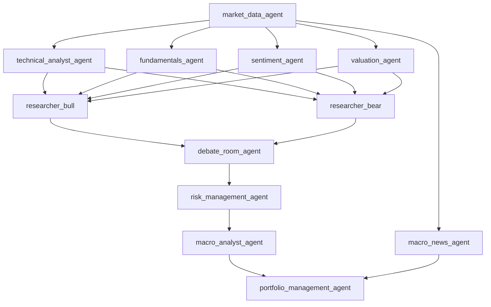

# 毕业设计执行指南（项目对齐与审计友好版 v3）

> 更新日期：2026-04-08  
> 适用仓库：`AShareAgent` 当前工作区  
> 本文用途：作为后续开发、论文撰写、联调验证和 Git 管理的统一执行标准  
> 本版本替代旧版“14 天冲刺清单式指南”，改为“工程规范 + 阶段路线图 + 审计友好口径”

---

## 1. 项目定位

- 课题名称：基于异构多智能体的 A 股价值投资分析系统
- 项目性质：计算机专业毕业设计，重点不在金融策略炫技，而在系统架构、协议设计、检索增强、实验方法与工程可复现性
- 核心贡献应聚焦于以下 3 点：
  1. 异构多智能体架构：规则、量化、统计、LLM 协同工作，而不是“全员调用大模型”
  2. 检索增强证据层：为主观分析型 Agent 提供可追溯的历史证据与记忆上下文
  3. 多维度消融评估：不仅比较收益，也比较延迟、成本、鲁棒性与可解释性

---

## 2. 截至 2026-04-08 的真实项目状态

### 2.1 已完成

- 已接入本地 CSV 适配层：`src/tools/local_csv_provider.py`
- 已完成 `api.py` 的本地优先改造，支持回测禁远程：`src/tools/api.py`
- 已完成 3 个非 LLM Agent 的异构重写：
  - `src/agents/technicals.py` -> `rule_engine`
  - `src/agents/valuation.py` -> `quantitative_model`
  - `src/agents/risk_manager.py` -> `statistical_model`
- 已完成 `market_data.py` 的 local-first 和 backtest-safe 改造：`src/agents/market_data.py`
- `tests/unit` 当前验证结果：`121 passed`

### 2.2 尚未完成

- `fundamentals.py` 仍是旧版规则式基本面分析，尚未升级为“护城河 + 证据检索”Agent
- `sentiment.py` 仍是旧版新闻情绪分析，尚未升级为“财报质量/红旗 + 文本解释”混合 Agent
- `macro_analyst.py` 仍是旧版宏观/新闻分析，尚未升级为“行业周期 + 政策敏感度”Agent
- 统一输出协议仍未正式落地
- 前端对异构 Agent 的展示还未完全按新结构对齐
- 消融实验框架未实现

### 2.3 当前真实工作流



说明：

- `market_data_agent` 是上游数据入口
- `technicals / fundamentals / sentiment / valuation` 是第一层分析节点
- `researcher_bull / researcher_bear / debate_room` 负责观点对抗与汇总
- `risk_management_agent` 与 `macro_analyst_agent` 在决策后段继续补充约束与环境判断
- `portfolio_management_agent` 是最终聚合节点

---

## 3. 仓库真相与边界条件

以下内容必须以当前仓库真实结构为准，而不是以旧版计划中的理想结构为准。

### 3.1 实际存在的核心 Agent 文件

- `src/agents/market_data.py`
- `src/agents/technicals.py`
- `src/agents/fundamentals.py`
- `src/agents/sentiment.py`
- `src/agents/valuation.py`
- `src/agents/researcher_bull.py`
- `src/agents/researcher_bear.py`
- `src/agents/debate_room.py`
- `src/agents/risk_manager.py`
- `src/agents/macro_analyst.py`
- `src/agents/macro_news_agent.py`
- `src/agents/portfolio_manager.py`

### 3.2 当前数据层真相

- 本地离线数据统一放在仓库根目录 `data/`
- 价格、PB、上市信息、交易日历已经有本地 CSV 入口
- 新闻、宏观、部分财务数据仍可能依赖远程接口或本地 SQLite 缓存
- 项目已有 SQLite 数据库能力，默认数据库文件位于 `data/ashare_agent.db`

### 3.3 当前依赖真相

- 已有：`langgraph`、`langchain`、`akshare`、`yfinance`、`openai` 等
- 尚无：`chromadb`、`sentence-transformers`、`faiss`
- 因此后续 RAG 设计不得假设“向量库已经存在”

---

## 4. 不可破坏的硬约束

后续所有改造都必须遵守以下约束。

### 4.1 LangGraph 外层返回结构不变

每个节点仍然必须返回：

```python
{
    "messages": ...,
    "data": ...,
    "metadata": ...,
}
```

不得将 LangGraph 节点直接改为只返回单一 Pydantic 对象。

### 4.2 local-first 是基础原则

- 价格链路默认优先走本地 CSV
- 回测模式下禁止远程价格接口
- 回测模式下新增的 RAG 也必须支持本地运行与可重复执行

### 4.3 RAG 不能成为单点故障

- 知识库不可用时，Agent 仍需给出合法输出
- 检索失败时要走降级路径，不允许拖垮主流程
- 不允许因为向量检索异常导致整个工作流中断
- 不允许因为语义相似而跨股票代码误召回历史分析

### 4.4 `agent_outputs` 是标准化输出层，不替代主流程通信

- 决策主链当前主要消费 `messages` 与 `data`
- `agent_outputs` 的作用是：
  - 为前端提供统一展示结构
  - 为测试提供稳定断言入口
  - 为后续协议统一做铺垫
- 因此新 Agent 必须同时维护：
  - 现有消息通道
  - 现有 `data` 字段
  - 标准化 `agent_outputs`

### 4.5 消息命名必须稳定

后续工作中必须统一以下消息命名约定：

- `technical_analyst_agent`
- `fundamentals_agent`
- `sentiment_agent`
- `valuation_agent`
- `researcher_bull`
- `researcher_bear`
- `debate_room_agent`
- `risk_management_agent`
- `macro_analyst_agent`
- `portfolio_management_agent`

说明：

- 历史上存在 `researcher_bull_agent` / `researcher_bull` 等兼容别名
- 后续新增逻辑应以“单一规范命名”为目标，兼容逻辑仅保留在过渡阶段

### 4.6 Git 仓库卫生必须受控

以下内容默认不进入 GitHub：

- `data/`
- `.superpowers/`
- `stitch/`
- 本地数据库文件
- 本地缓存、日志、截图、预览文件
- 会议记录类文件，除非明确需要纳入版本管理

---

## 5. 优化后的总体技术路线

### 5.1 总原则

本项目不是“所有 Agent 都用 LLM”的系统，也不是“把所有数据向量化”的系统。

优化后的技术路线应为：

1. 结构化因子继续走确定性计算
2. 主观分析类任务引入检索增强
3. 统一输出协议逐步收敛
4. 前端与实验框架围绕异构特征展开

### 5.2 异构架构分层

| 层级 | 作用 | 典型节点 | 主要方法 |
|:--|:--|:--|:--|
| 数据层 | 提供本地优先输入 | `market_data_agent` | CSV / SQLite / API |
| 确定性分析层 | 输出可重复、低延迟信号 | `technicals` / `valuation` / `risk_manager` | 规则 / 数学模型 / 统计 |
| 证据增强分析层 | 处理主观文本判断 | `fundamentals` / `sentiment` / `macro_analyst` | LLM + 检索 + 规则 |
| 观点博弈层 | 多空观点整合 | `researcher_bull` / `researcher_bear` / `debate_room` | Prompt + 聚合 |
| 决策层 | 最终交易建议 | `portfolio_manager` | 聚合决策 |

---

## 6. 最适合本项目的 RAG 架构

### 6.1 推荐结论

本项目推荐采用：

**元数据约束的记忆型 RAG（Metadata-Constrained Memory RAG）**

更准确地说，这是一种面向金融实体隔离场景的检索增强方案。它的核心目标不是“尽可能多地召回相似文本”，而是：

1. 先确保不会串票
2. 再在安全边界内做语义匹配
3. 最后把少量高价值历史记忆注入当前分析

### 6.2 为什么它比通用双召回更适合本项目

本项目面临的首要风险不是“漏召回”，而是“跨标的误召回”。

典型风险包括：

- 分析 `600519` 时误召回 `000858` 的历史结论
- 白酒、银行、电力等同质化板块中，因为文本表述相似而出现实体交叉污染
- 同一只股票在不同季度被错误继承不适用的旧结论

因此，本项目的 RAG 必须优先解决：

- `stock_code` 隔离
- `quarter / as_of_date` 隔离
- `agent_type` 隔离

这意味着：

- 对你来说，“硬过滤”比“更复杂的召回策略”更重要
- RAG 是 Agent 的长期记忆系统，不是通用搜索引擎

### 6.3 本项目中的“双通道”应如何定义

如果论文中需要保留“双通道”表述，应使用以下定义，而不是照搬通用文档问答系统的说法。

本项目的“双通道”是：

1. 结构化硬通道：基于元数据进行绝对过滤
2. 非结构化软通道：在硬过滤后的安全候选集内做语义检索

也就是说，本项目不是：

- `BM25 + 向量` 的开放域双召回
- `文本 + 视觉` 的多模态双通道

而是：

- `Metadata Hard Filter + Semantic Retrieval`

### 6.4 推荐检索流程

推荐的检索流程固定为：

1. 按 `stock_code` 做硬过滤
2. 再按 `quarter / as_of_date / agent_type / industry` 做二级过滤
3. 仅在过滤后的候选集上做语义相似度排序
4. 返回 `top_k=3~5` 条历史记忆
5. 仅将摘要、引用和来源注入 Prompt
6. 当前分析完成后，将结果回写到知识库

推荐原则：

- “先隔离，再相似”
- 不允许“先全库相似，再人工解释”

### 6.5 为什么不采用“全量向量化”

以下数据不适合放入向量库作为主存储：

- OHLCV 时序
- PB 历史序列
- 技术指标
- DCF 计算中间量
- VaR、波动率、回撤等纯数值因子

原因：

- 这类信息更适合精确计算，不适合语义检索
- 向量化会引入不必要的不确定性
- 会削弱回测可重复性和可解释性

因此，本项目的 RAG 更接近“记忆增强层”，而不是“统一知识存储层”。

### 6.6 最适合当前仓库的存储方案

推荐采用“两级实现策略”。

#### 第一阶段：SQLite-first 记忆基线方案

- 继续使用现有 `data/ashare_agent.db`
- 在数据库内新增知识库相关表
- 把知识库存储为“带元数据的分析记忆”，而不是泛文档仓库

推荐表结构方向：

- `kb_documents`
- `kb_chunks`
- `kb_analysis_history`

最低元数据字段应包含：

- `stock_code`
- `industry`
- `agent_type`
- `analysis_date`
- `quarter`
- `source_type`

推荐检索实现：

1. 先做元数据过滤
2. 再做候选集内文本匹配或轻量相似度排序
3. 返回少量高相关历史记忆

优点：

- 与当前项目已有 SQLite 能力天然兼容
- 回测模式更稳定
- 不新增重依赖
- 更适合先把 Day4 跑通

#### 第二阶段：可插拔向量增强方案

当基线方案跑通后，再可选增加：

- `sentence-transformers` 作为 embedding 组件
- `ChromaDB` 或其他向量后端作为候选集内增强排序层

注意：

- 向量层是增强，不是唯一依赖
- 不应把 `fundamentals.py` 直接绑死到某一向量库实现
- 即使使用 `ChromaDB`，也必须保留元数据硬过滤优先级

### 6.7 哪些内容进入知识库

应该进入知识库：

- 历史 `fundamentals` 输出的护城河分析摘要
- 公司相关新闻正文与元数据
- 宏观政策、行业公告、行业周期材料
- 人工整理后的“公司竞争优势事实摘要”
- 财报中的文本性风险点与摘要性证据

不应该直接进入知识库作为主检索对象：

- 原始 OHLCV
- 原始 PB 时序
- 高频技术指标
- 纯数值财报字段全集
- 完整 chain-of-thought
- 高频噪声缓存

### 6.8 RAG 输出注入原则

RAG 不应把整段原文塞进 `state["messages"]`。

推荐只传递：

- 检索摘要
- 引用片段列表
- 文档 ID / citation ID
- 使用到的证据来源说明
- 当前检索条件摘要，例如 `stock_code` 与时间范围

这样可以避免：

- 状态膨胀
- 重复传递大段文本
- 下游聚合节点被无关上下文污染

### 6.9 RAG 降级策略

知识库模块必须支持以下降级：

1. 数据库不可用：返回空检索结果，不抛致命异常
2. 元数据过滤无结果：继续按无历史记忆模式运行
3. 文本匹配或向量排序不可用：回退到更简单的候选集匹配
4. 检索为空：Agent 继续按无检索上下文运行

### 6.10 论文表述建议

工程实现中，统一使用：

- `元数据约束的记忆型 RAG`

论文中，如需更有方法论风格的名称，可表述为：

- `异构双通道检索策略`

但正文必须明确说明：

- 通道一是结构化元数据硬过滤
- 通道二是过滤范围内的语义检索
- 它不是开放域 BM25+向量双召回，也不是文本+视觉双通道

审计友好提醒：

- 不要在未完成实验前写“错误率为 0”
- 不要在未实际落地 SQL 过滤时写“SQL 级别硬隔离”
- 推荐写“元数据硬过滤”或“实体级硬约束”

---

## 7. Agent 改造目标矩阵

### 7.1 已完成的异构 Agent

| 文件 | 目标角色 | 类型 | 状态 |
|:--|:--|:--|:--|
| `src/agents/technicals.py` | 估值位置分析 Agent | `rule_engine` | 已完成 |
| `src/agents/valuation.py` | DCF 估值 Agent | `quantitative_model` | 已完成 |
| `src/agents/risk_manager.py` | 风险评估 Agent | `statistical_model` | 已完成 |

### 7.2 下一阶段必须完成的 Agent

| 文件 | 目标角色 | 推荐实现 | 状态 |
|:--|:--|:--|:--|
| `src/agents/fundamentals.py` | 护城河/竞争优势 Agent | `llm_rag` | 待完成 |
| `src/agents/sentiment.py` | 财报质量与文本红旗 Agent | `hybrid_rule_llm` | 待完成 |
| `src/agents/macro_analyst.py` | 行业周期与政策敏感度 Agent | `llm` | 待完成 |

---

## 8. 三个待改造 Agent 的明确要求

### 8.1 `fundamentals.py`：护城河与竞争优势 Agent

目标：

- 不再只做传统财务指标打分
- 升级为“结构化财务事实 + 同标的历史记忆检索 + LLM 分析”的综合 Agent

建议分析维度：

- 品牌壁垒
- 成本优势
- 转换成本
- 网络效应
- 渠道或规模壁垒
- 政策或牌照壁垒

最低输出要求：

- `agent_type`
- `signal`
- `confidence`
- `moat_rating`
- `score`
- `reasoning`
- `retrieved_refs`
- `memory_scope`

必须满足：

- 兼容现有 `fundamentals_agent` 函数签名
- 兼容现有 LangGraph 外层 state 返回结构
- 标准化结果写入 `state["data"]["agent_outputs"]["fundamentals"]`
- 检索失败时仍返回合法 JSON
- 检索时必须先按 `stock_code` 做硬过滤
- 如有时间维度，再按 `quarter / as_of_date` 做二级过滤

### 8.2 `sentiment.py`：财报质量与文本红旗 Agent

目标：

- 从“简单新闻情绪”转向“规则红旗 + 文本解释”的混合路径

第一层规则建议：

- 应收账款增速显著高于营收增速
- 经营现金流显著弱于净利润
- 商誉占净资产比例过高
- 存货周转率持续下滑

第二层 LLM 职责：

- 解释这些红旗意味着什么
- 给出风险等级与结论摘要

必须满足：

- 即使 LLM 失败，规则层结果也必须可用
- 输出至少包含：红旗数量、红旗清单、风险结论
- 标准化结果写入 `state["data"]["agent_outputs"]["sentiment"]`

### 8.3 `macro_analyst.py`：行业周期与政策敏感度 Agent

目标：

- 从“泛新闻解释”转向“行业位置 + 周期阶段 + 政策敏感度”分析

建议分析维度：

- 行业周期阶段：成长期 / 成熟期 / 下行期 / 复苏期
- 政策敏感度
- 景气度趋势
- 监管风险
- 宏观环境对个股的传导路径

必须满足：

- 输出结构稳定
- 检索与 LLM 失败时有默认兜底
- 标准化结果写入 `state["data"]["agent_outputs"]["macro_analyst"]`

---

## 9. Prompt 改造原则

待调整文件：

- `src/agents/researcher_bull.py`
- `src/agents/researcher_bear.py`
- `src/agents/portfolio_manager.py`

优化原则：

- 从“泛看多/看空”改为“价值投资语境下的多空论证”
- `researcher_bull` 重点关注：
  - 安全边际
  - 护城河
  - 竞争优势
  - 长期价值兑现
- `researcher_bear` 重点关注：
  - 估值泡沫
  - 财报质量风险
  - 行业下行
  - 政策压制
- `portfolio_manager` 重点关注：
  - 安全边际优先
  - 风险暴露约束
  - 组合层面仓位合理性

注意：

- Prompt 可以改，但下游读取的 JSON 结构和关键字段不应随意变化

---

## 10. 统一输出协议目标

### 10.1 当前阶段要求

每个 Agent 至少在 `agent_outputs` 中输出以下最小字段：

- `agent_type`
- `signal`
- `confidence`
- `reasoning`

如有结构化分析结果，继续补充：

- `structured_data`
- `citations`
- `risk_metrics`
- `valuation_metrics`
- `retrieved_refs`

### 10.2 下一阶段目标

后续可创建统一协议模型，例如 `AgentMessage`，但必须遵守：

- 只作为内部标准化对象
- LangGraph 外层返回结构不变
- 老的消息链路继续兼容

---

## 11. 剩余开发路线图

### Day 4：知识库基线 + `fundamentals` 升级

目标：

- 新建 `src/rag/knowledge_base.py`
- 先实现 SQLite-first 的元数据记忆检索基线
- 完成 `fundamentals.py` 的记忆型 RAG 改造

验收标准：

- 知识库不可用时 `fundamentals` 仍可正常返回
- `fundamentals` 输出包含 `retrieved_refs`
- `fundamentals` 输出包含 `memory_scope`
- 检索流程明确体现 `stock_code` 硬过滤
- 单测覆盖检索成功、检索为空、知识库异常三类路径

### Day 5：`sentiment` + `macro_analyst` 重写

目标：

- 完成规则红旗 + LLM 解释的 `sentiment`
- 完成行业周期 + 政策敏感度的 `macro_analyst`

验收标准：

- 两个 Agent 都写入 `agent_outputs`
- 失败路径都有兜底输出
- 不破坏现有工作流连通性

### Day 6：协议收敛 + 5 只股票联调

建议测试标的：

- `600519`
- `000333`
- `601398`
- `002415`
- `601857`

验收标准：

- 主流程可跑通
- 输出结构稳定
- 前端可消费核心字段

### Day 7：前端最小必要增强

目标：

- 展示 `agent_outputs`
- 展示 `agent_type / signal / confidence`
- 具备引用和性能字段的扩展位置

验收标准：

- 前端不需要花哨，但必须能看出“异构”而不是“一堆文本日志”

### Day 8：消融实验框架

目标：

- 复用 `src/backtesting/`
- 构建异构与非异构配置对比

至少比较以下配置：

- `full_heterogeneous`
- `full_homogeneous`
- `no_rule_agents`
- `no_llm_agents`
- `remove_single_agent_x`

至少输出以下指标：

- 年化收益
- 夏普比率
- 最大回撤
- 平均响应时间
- Token 消耗
- API 可用性/降级次数

---

## 12. 验证与完成定义

### 12.1 每轮开发完成前必须验证

- 单测通过
- 新增功能至少有一个失败路径测试
- 不引入对 `data/` 被 Git 跟踪的隐性依赖
- 回测模式不偷偷访问远程接口

### 12.2 每个关键模块的完成定义

一个模块只有同时满足以下条件才算完成：

1. 代码实现落地
2. 失败路径有兜底
3. 单测覆盖核心逻辑
4. 不破坏现有 LangGraph 主流程
5. 输出结构能被前端或测试消费

---

## 13. Git 与分支策略

推荐原则：

- 功能开发走 `codex/<topic>` 分支
- 大数据和本地环境文件不进 GitHub
- 提交前先确认：
  - `data/` 未被追踪
  - `.superpowers/` 未被追踪
  - `stitch/` 未被追踪
  - 本地数据库未被追踪

---

## 14. 论文素材清单

后续实现过程中应主动积累以下素材：

- 本地优先数据链路截图
- 3 个非 LLM Agent 的代码与运行截图
- RAG 检索日志与引用样例
- `fundamentals` 检索前/检索后对比样例
- 统一输出协议样例
- 5 只股票的联调输出截图
- 消融实验结果表格

---

## 15. 这份指南的执行原则

从本版本开始，后续工作统一按以下顺序推进：

1. 先对齐仓库真实状态
2. 再确定不可破坏的约束
3. 再做模块实现
4. 最后做联调、前端和实验

换句话说：

- 不再为了“照着旧指南完成任务”而硬套不合适的实现
- 一切以“最适合当前项目的工程方案”为准
